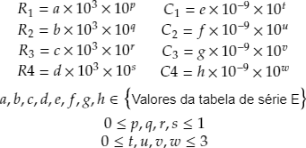

# Projeto de filtros ativos utilizando algoritmo evolucionário

Trabalho de conclusão do curso para obtenção de certificado no Curso de Especialização – Latu Sensu em
Engenharia de Desenvolvimento de Projetos Eletrônicos da União Brasileira de Faculdades, UniBF.

O trabalho consiste em aplicar algoritmo evolucionário para o projeto de filtros ativos, buscando obter a melhor
relação de valores de componentes eletrônicos (resistores e capacitores) disponíveis comercialmente a fim
de atender os requisitos de projeto do filtro ativo. 

**Aqui está uma versão bem resumida e simplificada do trabalho submetido.**

# 1. Metodologia e Resultados

Todo o projeto é baseado na otimização de um circuito de filtro ativo passa-baixas com resposta do tipo Butterworth.
Este tipo de resposta é caracterizado por uma curva plana na região em que as frequências devem passar e após a
frequência de corte deve haver uma queda de n*20dB por década, onde n corresponde a ordem do filtro.

<p align="center">
</p>

Os algoritmos de otimização correspondem a técnicas para encontrar o melhor resultado conforme um determinado objetivo,
podendo ser implementados em diferentes aplicações.

Neste trabalho, o algoritmo de otimização deverá buscar a melhor seleção de componentes eletrônicos (resistores e 
capacitores) com valor comercial a fim de satisfazer os critérios de resposta do filtro. Os valores de componentes 
eletrônicos seguem o padrão [E Series](http://en.wikipedia.org/wiki/E_series_of_preferred_numbers), onde cada série 
possui uma sequência de valores base que é multiplicada por uma potência de 10 para obter o valor do componente.

<p align="center">
</p>

## 1.1 Equações dos filtros ativos

Para este trabalho foi escolhida a topologia de filtros Sallen Key de 4a ordem, que é composto por dois estágios de 2a
ordem, como é mostrado na figura a seguir:

<p align="center">

</p>

Para a escolha dos componentes de cada estágio do filtro, é necessário que os valores escolhidos para os componentes 
satisfaçam as seguintes equações:

<p align="center">

</p>

Onde Qi é um valor tabelado e corresponde ao fator de qualidade de cada estágio do filtro e fc é a frequência de corte 
do filtro. Os valores dos resistores são recomendados para a faixa de 1kΩ a 100kΩ, enquanto para os capacitores 
recomenda-se a faixa de 1nF a alguns µF.

## 1.2 Otimização

A otimização utilizada foi do tipo algoritmo evolucionário, onde uma população de indivíduos com as características do
projeto são avaliados e competem para serem o melhor da população. Este algoritmo realiza processos de recombinação dos
indivíduos, misturando as suas características e as alterando para gerar um novo indivíduo de forma que este processo se
repete por n gerações até a satisfação do critério de parada. O fluxograma a seguir ilustra este processo:

<p align="center">

</p>

Para a montagem do problema de otimização, cada indivíduo terá como parâmetros os valores para o cálculo dos seus
componentes, conforme as seguintes equações:

<p align="center">

</p>

Dessa forma, cada componente terá 2 variáveis: uma para identificar o valor da série E utilizada e outra para
caracterizar a ordem de grandeza do componente.

Para a avaliação do indivíduo, será utilizada a seguinte função:

<p align="center">

</p>

Esta função contém duas partes: A primeira identifica o desvio do fator de qualidade de cada estágio em relação ao valor
tabelado e a segunda identifica o desvio da frequência de corte de cada estágio em relação à frequência desejada. O
objetivo do algoritmo será minimizar esta função de forma que o desvio seja o mínimo.

## 1.3 Resultados

Para analisar o algoritmo implementado, foi escolhido um filtro passa-baixas cuja frequência de corte é de 5kHz, e 
foram feitas três execuções diferentes do algoritmo utilizando valores das séries E12, E24 e E48. Para a otimização 
foi utilizada uma população de 100 indivíduos em um processo de execução de 1000 gerações, utilizando uma probabilidade 
de cruzamento igual a 50% e uma probabilidade de mutação igual a 20% a cada geração. A tabela a seguir apresenta os
resultados obtidos:

<p align="center">

</p>

A função de custo em todas as séries foi muito pequena, indicando que o filtro obterá uma boa resposta utilizando estes
valores de componentes. Após a simulação no LTspice obteve-se o seguinte gráfico, validando a funcionalidade do
algoritmo:

<p align="center">

</p>

# 1.4 Considerações

A aplicação de técnicas de otimização para encontrar valores de componentes eletrônicos é bem útil, visto que o 
projetista não precisa de ficar em um processo repetititvo de tentativa e erro, além de também poder limitar a escolha
conforme a disponibilidade do momento. Esta técnica pode ser aplicada em outros tipos de projetos também, desde que o
problema seja modelado de forma correta.

# 2. Execução do código

O projeto foi todo feito na linguagem [Python](https://www.python.org), com o auxílio das bibliotecas 
[Numpy](https://numpy.org) e [DEAP](https://github.com/DEAP/deap). O software 
[LTspice](https://www.analog.com/en/design-center/design-tools-and-calculators/ltspice-simulator.html) foi utilizado 
como software de simulação para a análise dos resultados.

Requisitos:

* Python 3.9+ (Pode funcionar em versões mais antigas, mas não foi testado)
* Bibliotecas do arquivo ```./Python/requirements.txt```

O código de otimização para cada série está nos scripts ```./Python/e12_series.py```, ```./Python/e24_series.py``` e
```./Python/e48_series.py```. Cada script possui suas próprias configurações de otimização e das características do
filtro e após a execução o resultado é salvo em um arquivo no formato json na pasta ```./Python/results```.

O script ```./Python/ltspice_generator.py``` utiliza dos arquivos json de resultados para criar um filtro com os 
componentes obtidos da otimização no formato .asc que é utilizado pelo LTSpice para simulações.

# 3. Referências bibliográficas

Aqui estão algumas das principais referências utilizadas no TCC:

CARTER, Bruce; MANCINI, Ron. **Op Amps for everyone**. Newnes, 2017.

DE RAINVILLE, François-Michel et al. **DEAP: A python framework for evolutionary algorithms**. Proceedings of the 14th
annual conference companion on Genetic and evolutionary computation. 2012. p. 85-92.

DE, Bishnu Prasad et al. **Optimal selection of components value for analog active filter design using simplex particle 
swarm optimization**. International Journal of Machine Learning and Cybernetics, v. 6, n. 4, p. 621-636, 2015.

GOLDBERG, D. E. **Genetic Algorithms in Search, Optimization, and Machine Learning**. 1. ed. Boston, Massachusetts:
Addison-Wesley Publishing Company, 1989. 432 p.

RAO, S. S. **Engineering optimization: theory and practice**. 4. ed. Hoboken, New Jersey: John Wiley & Sons, 2009. 830p.

WIKIPÉDIA. **E series of preferred numbers**. Disponível em: http://en.wikipedia.org/wiki/E_series_of_preferred_numbers.
Acesso em: 25 nov. 2021.